# 基于深度强化学习的四足机器人运动控制研究

要参考HIMLOCO快速完成基于深度强化学习的四足机器人运动控制研究论文的实验部分，你可以按照以下步骤进行：

### 1. 环境搭建
- **克隆HIMLOCO仓库**：首先，从HIMLOCO的代码仓库中将代码克隆到本地。你可以使用`git clone`命令：
```bash
git clone <HIMLOCO仓库地址>
cd HIMLOCO
```
- **安装依赖**：根据HIMLOCO的文档，安装所需的依赖库。一般来说，这可能包括Python环境、PyTorch、Isaac Gym等。例如，使用`pip`安装Python依赖：
```bash
pip install -r requirements.txt
```

### 2. 理解HIMLOCO代码结构
- **关键文件和类**：参考你提供的HIMLOCO代码，了解关键的类和函数。例如：
    - `commands`类定义了机器人的命令相关参数，如速度范围、命令重采样时间等。
    - `_post_physics_step`函数用于在物理步骤之后进行一些计算，包括检查终止条件、计算观测值和奖励等。
- **代码模块**：明确各个模块的功能，例如`legged_robot.py`文件中包含了机器人的各种处理函数，如`_push_robots`用于随机推动机器人，`_disturbance_robots`用于随机添加干扰力等。

### 3. 实验设计
- **确定实验目标**：明确你论文中要研究的四足机器人运动控制问题，例如研究不同奖励函数对机器人运动性能的影响，或者探索不同算法在四足机器人运动控制中的表现。
- **选择实验参数**：参考HIMLOCO中的配置文件，如`legged_robot_config.py`中的`algorithm`类，该类定义了训练参数，包括价值损失系数、学习率、熵系数等。你可以根据实验目标调整这些参数。
- **设计对比实验**：为了验证你的方法的有效性，可以设计对比实验。例如，对比不同的控制类型（如`control`类中的`control_type`）对机器人运动的影响。

### 4. 实验实施
- **修改代码**：根据你的实验设计，修改HIMLOCO的代码。例如，如果你要研究不同奖励函数的影响，可以修改`_reward_action_rate`函数或者添加新的奖励函数。
```python
def _reward_action_rate(self):
    # 原奖励函数，惩罚动作的变化
    original_reward = torch.sum(torch.square(self.last_actions - self.actions), dim=1)
    # 添加新的奖励项，例如鼓励机器人前进
    forward_vel_reward = self.base_lin_vel[:, 0]  # 机器人前进速度
    total_reward = original_reward + forward_vel_reward
    return total_reward
```
- **运行实验**：使用HIMLOCO提供的脚本或者自己编写脚本运行实验。在实验过程中，记录相关的数据，如机器人的运动轨迹、奖励值、训练损失等。

### 5. 结果分析
- **数据处理**：对实验记录的数据进行处理和分析。例如，计算平均奖励、成功率等指标。
- **可视化**：使用Matplotlib等工具将实验结果可视化，如绘制奖励曲线、机器人运动轨迹图等。例如，绘制训练过程中的奖励曲线：
```python
import matplotlib.pyplot as plt

# 假设rewards是一个列表，记录了每个训练步骤的奖励
rewards = [...]
plt.plot(rewards)
plt.xlabel('Training Steps')
plt.ylabel('Reward')
plt.title('Reward Curve during Training')
plt.show()
```

### 6. 论文撰写
- **实验描述**：在论文的实验部分，详细描述实验环境、实验设计、实验参数等。
- **结果展示**：展示实验结果，包括数据表格和可视化图表。
- **分析讨论**：对实验结果进行分析和讨论，解释结果的意义，与已有研究进行对比，指出实验的局限性和未来的研究方向。

 
 
## 经典内模估计+强化学习，四足机器人训练一小时，即可穿越任意地形
1. 采用混合内部模型：无激光雷达和摄像头，仅IMU和电机，无模仿学习，（只需要200M框架，RTX 4060上1小时高效学习） 
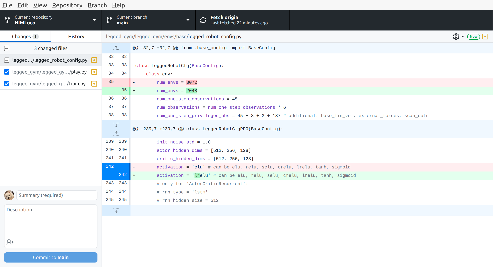

## **基于特权信息和课程指导的四足机器人的稳定技能提升**
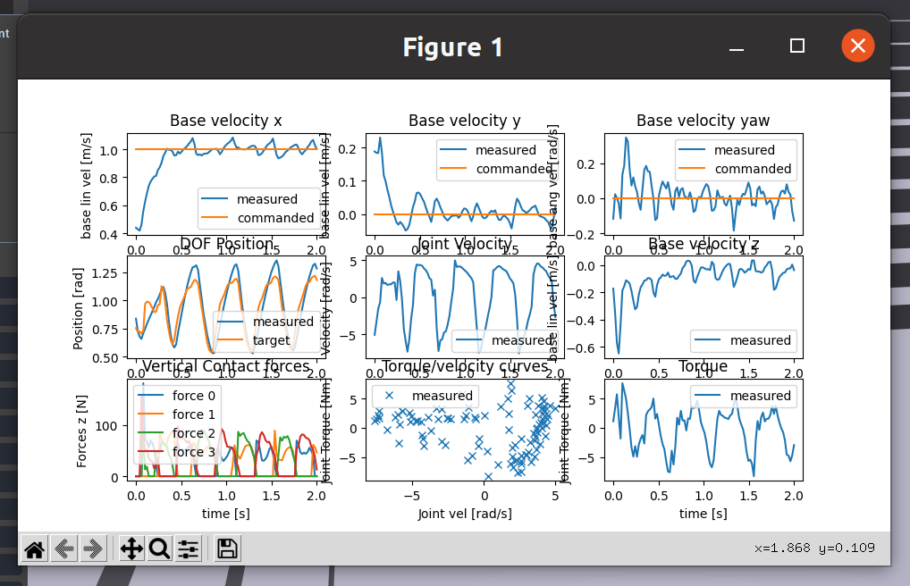

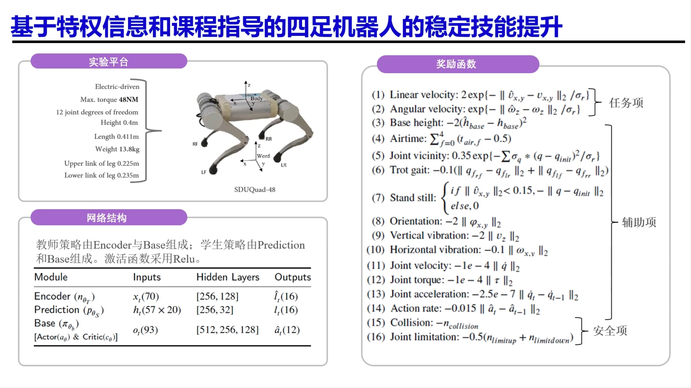

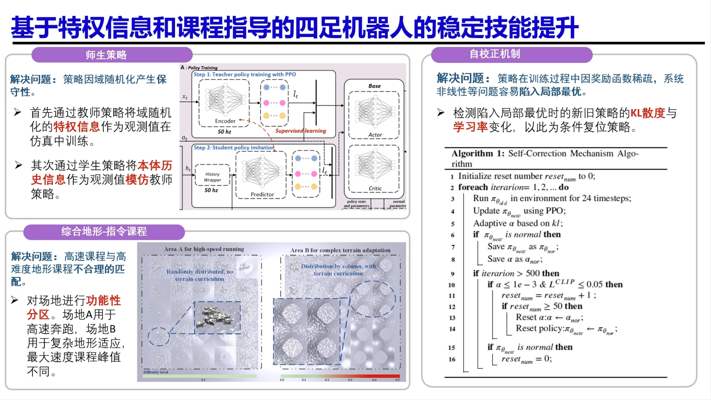

## 四足机器人及关键技术介绍
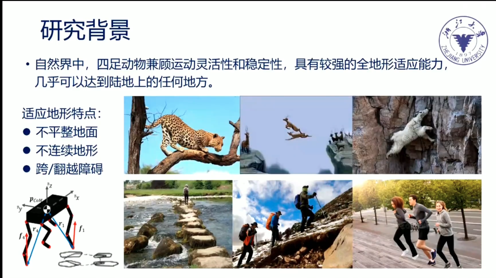
 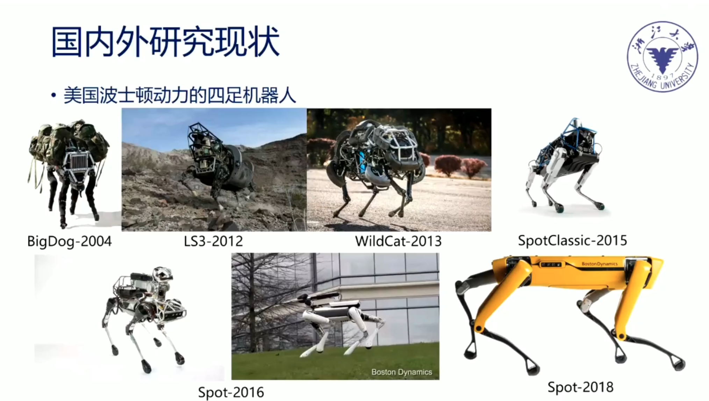
 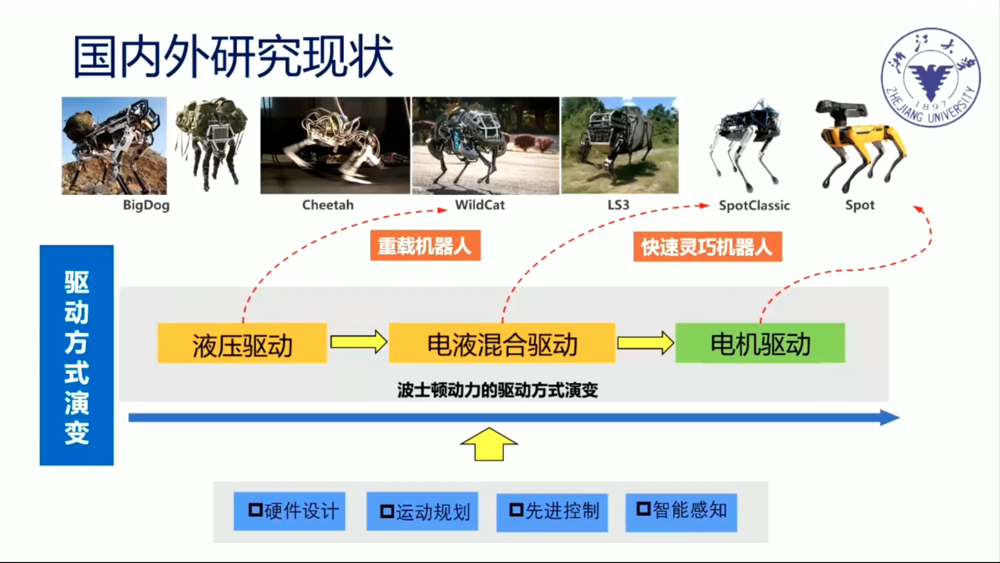
 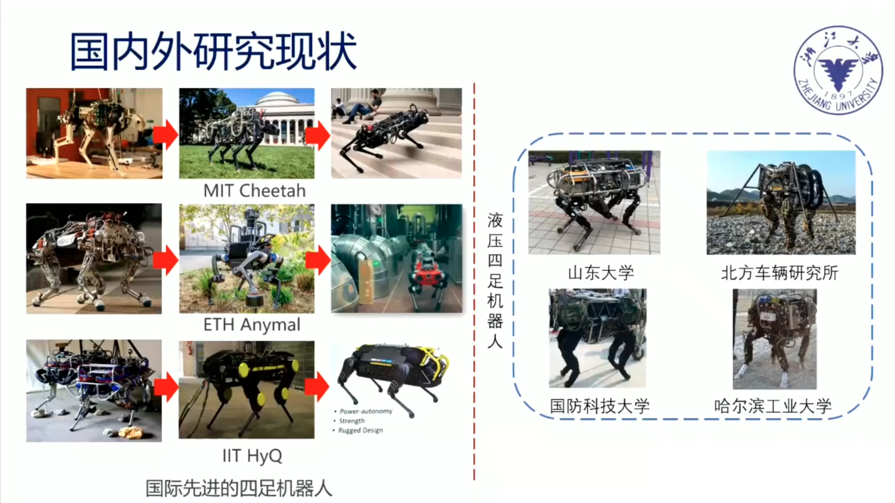
 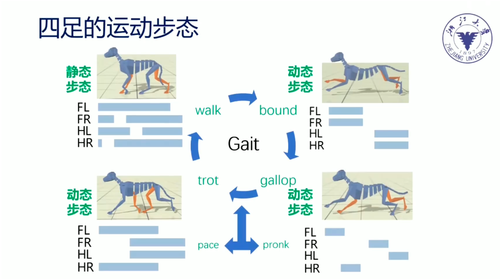
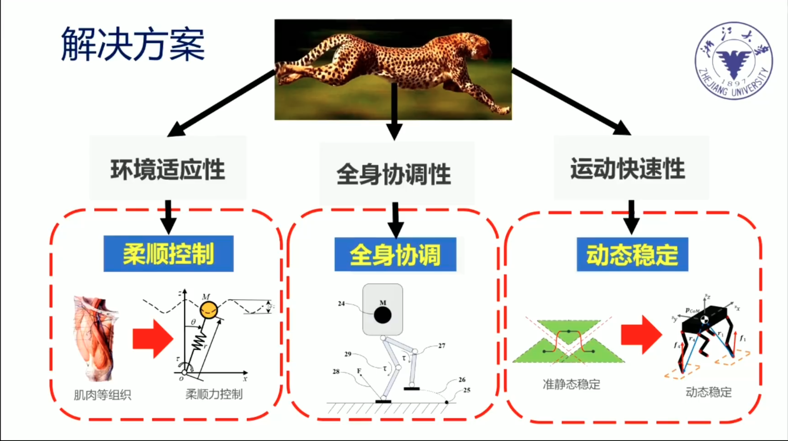
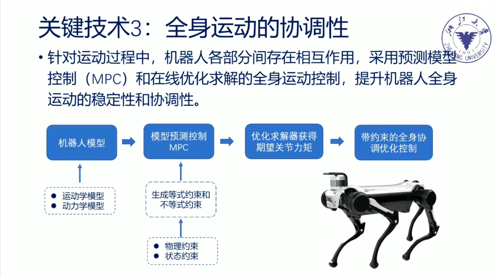