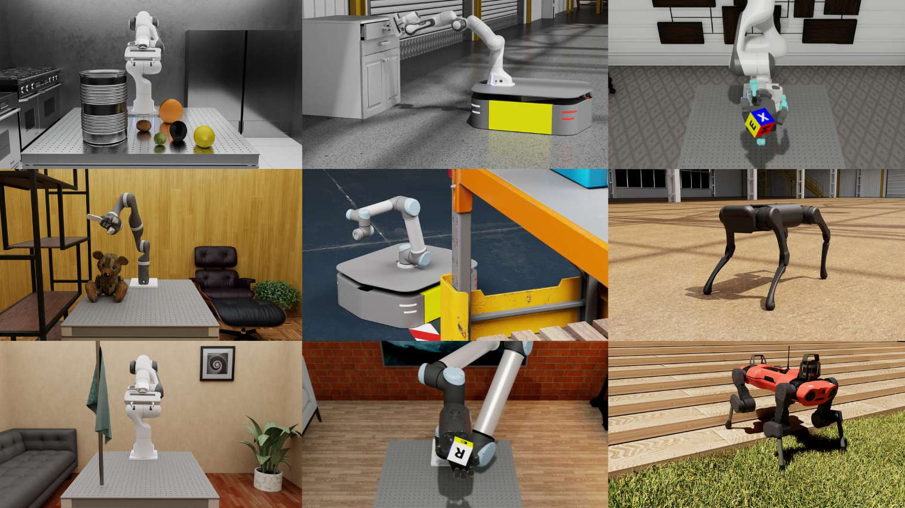
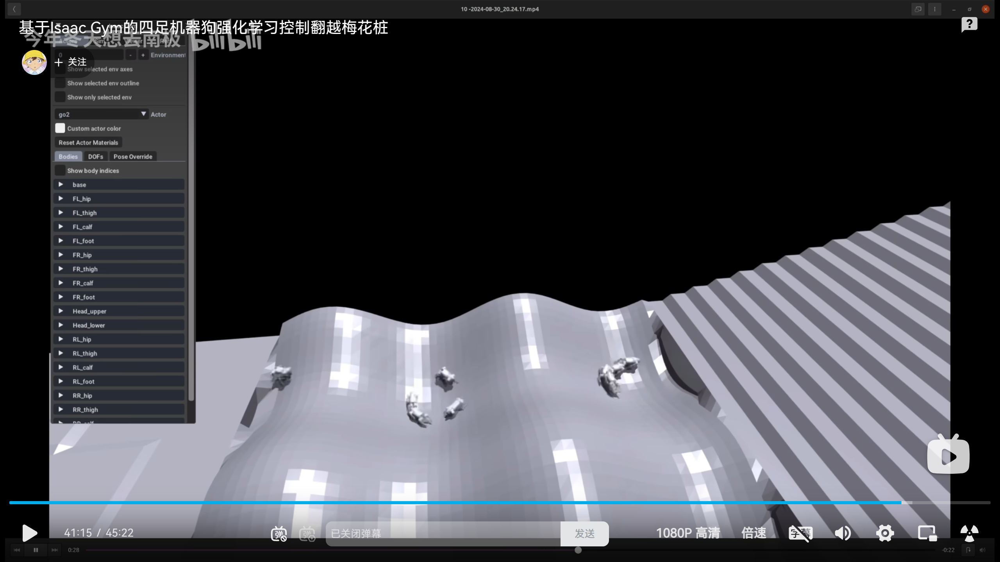
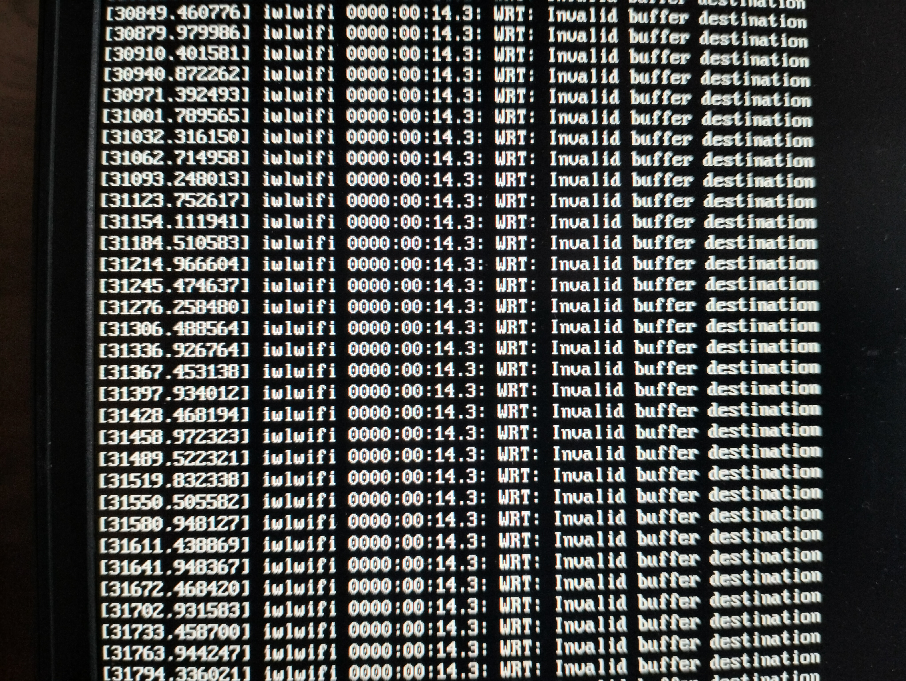
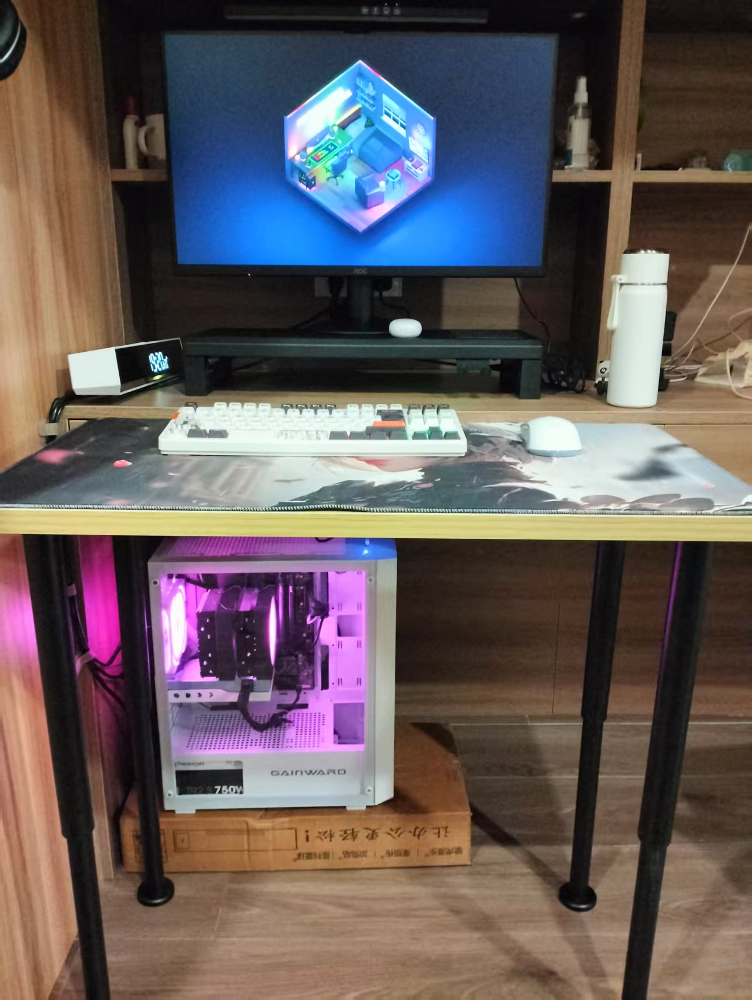
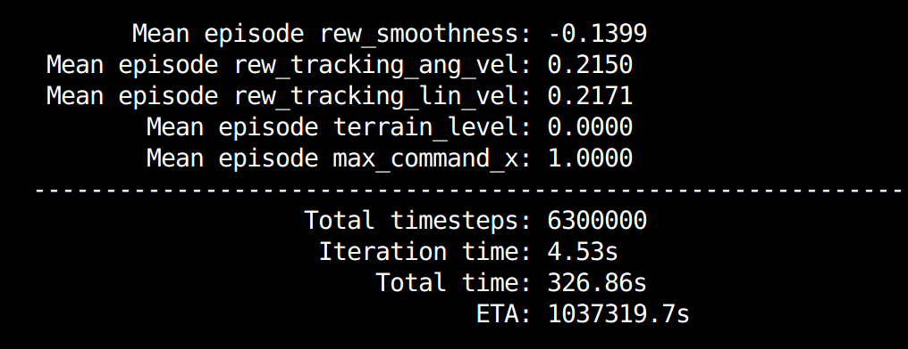
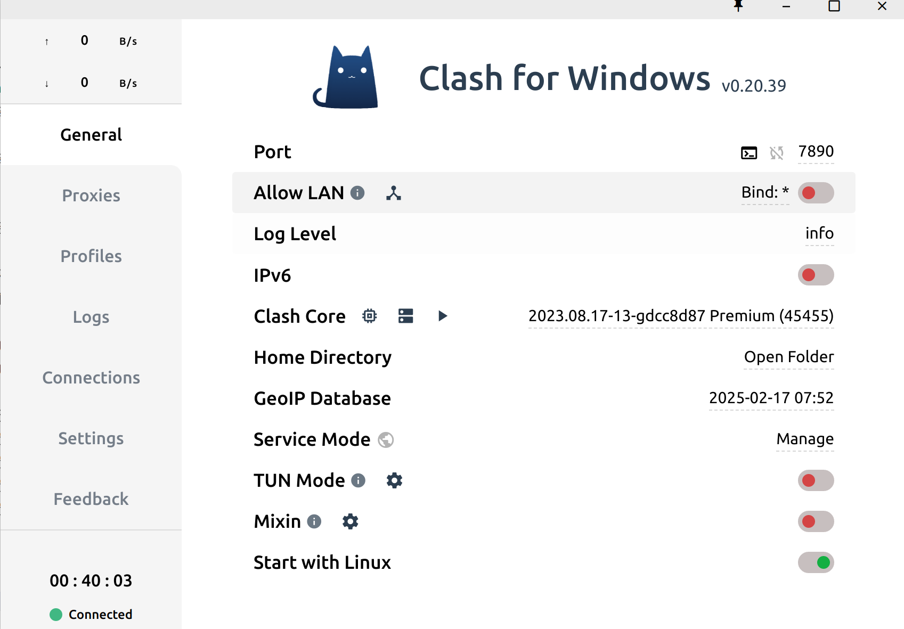
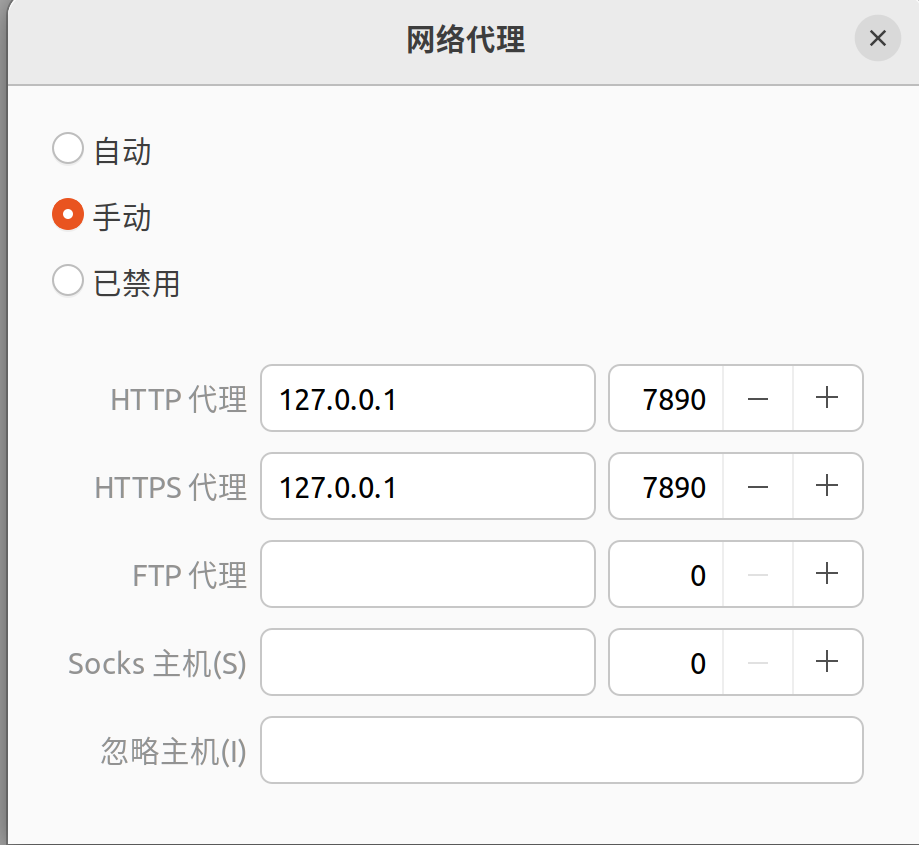
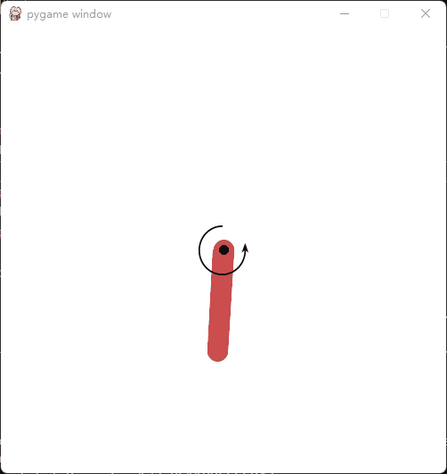

# 四足 DRL 运动控制研究

以下所有操作均针对 Linux 系统。

- [四足 DRL 运动控制研究](#四足-drl-运动控制研究)
  - [项目日志](#项目日志)
    - [\[2025 年 2 月 15 日\]](#2025-年-2-月-15-日)
    - [\[2025 年 2 月 16 日\]](#2025-年-2-月-16-日)
    - [\[2025 年 2 月 17 日\]](#2025-年-2-月-17-日)
    - [\[2025 年 2 月 18 日\]](#2025-年-2-月-18-日)
    - [\[2025 年 2 月 19 日\]](#2025-年-2-月-19-日)
    - [\[2025 年 2 月 27 日\]](#2025-年-2-月-27-日)
    - [\[2025 年 2 月 28 日\]](#2025-年-2-月-28-日)
    - [\[2025 年 3 月 1 日\]](#2025-年-3-月-1-日)
  - [极简环境配置](#极简环境配置)
    - [特定网络工具使用指南](#特定网络工具使用指南)
    - [Miniconda 安装](#miniconda-安装)
    - [显卡驱动安装](#显卡驱动安装)
    - [小鱼一键安装相关软件](#小鱼一键安装相关软件)
    - [Peek：Ubuntu 屏幕录制成 GIF 工具](#peekubuntu-屏幕录制成-gif-工具)
    - [VScode 开发与插件配置](#vscode-开发与插件配置)
  - [实战项目](#实战项目)
    - [基于 DDPG 算法的倒立摆控制](#基于-ddpg-算法的倒立摆控制)


## 项目日志
 
- 2月18日以前电脑配置如下：
    - 操作系统：Ubuntu 22.04
    - CUDA 版本：12.1
    - GPU：NVIDIA GeForce MX550
- 2月18日以后电脑配置如下：
    - 操作系统：Ubuntu 20.04
    - CUDA 版本：12.1
    - GPU：RTX 4060

### [2025 年 2 月 15 日]
最初使用常规的 `git clone` 命令克隆四足 RL 毕设项目代码时，由于会获取全量历史记录，导致原本 3.7MB 的 GitHub 压缩包项目在克隆后达到 900MB。采用 `git clone --depth 1` 命令可仅获取最新版本，有效减少磁盘占用与克隆时间。本项目的完整克隆命令为：
```bash
git clone --depth 1 https://github.com/cdh66666/Deep_RL_Control.git
```
之后，我新建了一个同名仓库，将原仓库资料迁移过来并去除了所有历史记录，现在项目大小仅为 3.7MB，且已删除原仓库。后续计划搭建环境并对代码进行测试。

### [2025 年 2 月 16 日]
为配置深度强化学习环境，我参考了 [ISAAC Lab 官方指导文档](https://isaac-sim.github.io/IsaacLab/main/source/setup/installation/pip_installation.html)，该文档详细阐述了环境搭建的步骤与要求。


同时，我还借鉴了 [isaacsim+isaaclab 一键安装脚本](https://www.bilibili.com/video/BV1k5BtYDEHU/?spm_id_from=333.337.search-card.all.click&vd_source=17ff47d01089cfbc609f2983503e8663) 视频中的方法。**特别注意**，<u>不管采用何种方法安装，都需预先配置好 miniconda 和 ros2 humble 环境。</u>

按照视频指导，通过执行以下命令可实现一键安装：
```bash
wget https://docs.robotsfan.com/install_isaaclab.sh -O install_isaaclab.sh && bash install_isaaclab.sh
```
执行上述命令后，所需环境便快速搭建完成，后续可基于此开展相关开发与测试工作。

目前，我已将所需环境全部安装至名为 `isaac` 的 Conda 虚拟环境中。激活该环境可使用如下命令：
```bash
conda activate isaac
```

激活后，能够正常使用 `isaacsim` 命令打开程序。然而，运行过程中出现诸多报错信息，且无法启用 GPU 加速功能，后续需对这些问题进行排查解决。 
 
### [2025 年 2 月 17 日]

在今日的工作中，安装 Isaac Lab 时频繁遭遇报错，致使安装工作未能成功。面对这一困境，我决定调整策略，重新尝试启用 Isaac Gym，期望以此为突破口推进相关工作。

与此同时，我开启了[强化学习训练 GO2 翻越多种地形](https://github.com/jindadu00/legged_robot_competition)项目的复刻工作。此项目极具研究价值与实践意义，它致力于运用强化学习算法，让 GO2 机器人在多样化的地形环境中自如地完成翻越动作。

 


### [2025 年 2 月 18 日]

在今日的工作中，我继续致力于解决 legged_robot 的安装和运行问题，期间尝试了多种方法来解决遇到的报错，但最终仍未能成功，推测可能是电脑硬件条件的限制。
 


1. **CUDA 内存分配失败**
    - **错误信息**：PxgCudaDeviceMemoryAllocator fail to allocate memory 339738624 bytes!! Result = 2
    - **解决尝试**：
        - 检查 GPU 内存使用情况：
```bash
nvidia-smi
```
- 清理 GPU 内存：
```python
import torch
torch.cuda.empty_cache()
```
- 减少 `num_envs` 的值，从 64 逐步减少到 16。
1. **非法内存访问**
    - **错误信息**：Gym cuda error: an illegal memory access was encountered
    - **解决尝试**：
        - 设置环境变量 `CUDA_LAUNCH_BLOCKING=1`：
```bash
export CUDA_LAUNCH_BLOCKING=1
```
- 使用 `cuda-memcheck` 工具检查内存访问错误：
```bash
cuda-memcheck python train.py --task=go2 --num_envs=16 --headless --max_iterations=50
```

尽管采取了上述一系列解决措施，运行训练脚本时依旧报错 CUDA 内存分配失败，目前怀疑是电脑的 GPU（NVIDIA GeForce MX550）性能不足所致，后续可能需要更换电脑以继续推进项目。 


### [2025 年 2 月 19 日]

今日，电脑状况频出，频繁出现黑屏现象，每次黑屏时，屏幕上便会浮现出一行行白字报错信息，详情可见：
 。鉴于此电脑不仅故障频发，且性能已难以满足当下需求，经过深思熟虑，我毅然决定更换台式电脑（8000元）。精心挑选的新电脑配置如下：
- 处理器：i5 - 13600KF
- 散热器：6管风冷散热器
- 主板：华硕b760M D5 带wifl 蓝牙
- 内存：威刚32G 6400高频内存
- 存储：金士顿1T固态硬盘
- 显卡：耕升4060 8G
- 机箱与电源：机箱搭配750W电源
- 显示器：AOC 27寸 2k 100hz 显示器 
 


### [2025 年 2 月 27 日]

新电脑已完成配置，整体外观如下所示：
 

首先进行 pytorch==2.4.0 & CUDA 12.1 相关环境的配置，具体执行以下命令：
```bash
conda install pytorch==2.4.0 torchvision==0.19.0 torchaudio==2.4.0 pytorch-cuda=12.1 -c pytorch -c nvidia
``` 

然后依照 [legged_robot_competition](https://github.com/jindadu00/legged_robot_competition) 项目的要求，重新搭建运行环境。

运行如下指令进行训练：
```bash
conda activate legged_robot
cd ~/legged_robot_competition/legged_gym/legged_gym/scripts

python train.py --task=go2 --num_envs=64 --headless --max_iterations=50
```

运行之后报错如下：
```bash
File "/home/cdh/legged_robot_competition/isaacgym/python/isaacgym/torch_utils.py", line 135, in <module>
    def get_axis_params(value, axis_idx, x_value=0., dtype=np.float, n_dims=3):
  File "/home/cdh/miniconda3/envs/legged_robot/lib/python3.8/site-packages/numpy/__init__.py", line 305, in __getattr__
    raise AttributeError(__former_attrs__[attr])
AttributeError: module 'numpy' has no attribute 'float'.
```
将下面路径代码的np.float改为float即可。
```bash
legged_robot_competition/isaacgym/python/isaacgym/torch_utils.py", line 135
```
继续运行，报错如下：
```bash
ModuleNotFoundError: No module named 'tensorboard'
```
执行以下命令安装：
```bash
conda install tensorboard
```
运行成功，开始训练。

运行如下指令进行模型测试：
```bash
conda activate legged_robot
cd ~/legged_robot_competition/legged_gym/legged_gym/scripts
#注意修改路径，时间，训练轮数
python play.py --task=go2 --num_envs=1  --checkpoint=50 --load_run=/home/cdh/legged_robot_competition/legged_gym/logs/rough_go2/Feb27_23-57-31_
```
运行结果如下：


### [2025 年 2 月 28 日]
今天，啥也没调，单纯增加训练轮数至5000轮，结果如下：

5000轮训练用了一个小时不到，比较快速，不过GPU利用率才45%，之后的训练尽量优化效果都在5000轮以内优化。

### [2025 年 3 月 1 日]
今天单纯增加训练轮数至25000轮，花了7.5h，结果如下：

训练效果很拉，需要自定义奖励函数，之后再进行优化。

同时，legged_gym项目会自动生成参数图表，方便写论文，如下图：


今天看到一个新项目，尝试复刻：**经典内模估计+强化学习，四足机器人训练一小时，即可穿越任意地形**
论文: https://arxiv.org/pdf/2312.11460
Github: https://github.com/OpenRobotLab/HIMLoco
项目网页: https://junfeng-long.github.io/HIMLoco/

**复刻记录如下：**
在运行 `HIMLoco` 项目的训练脚本 `train.py` 时，你主要遇到了两类问题，以下是详细总结：

**1. 共享库文件缺失**
- **问题表现**：运行脚本时抛出 `ImportError: libpython3.7m.so.1.0: cannot open shared object file: No such file or directory` 错误，系统无法找到 `libpython3.7m.so.1.0` 共享库文件。
- **排查思路**：首先确认 Python 3.7 是否已安装，之后使用 `find` 命令在系统中查找该共享库文件的具体位置。
- **解决办法**：将文件所在目录添加到动态链接库搜索路径。有临时和永久两种添加方式，临时添加可使用 `export` 命令；永久添加则需修改 `.bashrc` 文件并更新缓存。

**2. GPU 显存不足**
- **问题表现**：运行脚本时出现 `torch.cuda.OutOfMemoryError` 错误，显示 GPU 显存不足，无法分配所需的 100 MiB 内存。
- **排查思路**：批量大小会影响显存使用量，因未直接找到 `batch_size` 定义，根据代码里 `batch_size = num_envs * num_transitions_per_env` 的计算逻辑，通过 `grep` 命令查找 `num_envs` 和 `num_transitions_per_env` 的定义。
- **解决办法**：
    - `num_envs` 在 `/home/cdh/HIMLoco/legged_gym/legged_gym/envs/aliengo/aliengo_config.py` 和 `/home/cdh/HIMLoco/legged_gym/legged_gym/envs/base/legged_robot_config.py` 文件中被赋值为 `4096`，可将其修改为较小值（如 `1024` 或 `512`）。
    - 对于 `num_transitions_per_env`，查找结果中未发现其具体赋值，需进一步在代码中搜索默认值并尝试减小。
    - 还可尝试其他减少显存占用的方法，如释放不必要的显存（使用 `torch.cuda.empty_cache()`）、采用混合精度训练、检查数据加载和预处理、简化模型结构、使用多 GPU 训练以及设置 `max_split_size_mb` 等。 


 
## 极简环境配置
### 特定网络工具使用指南
参考链接：[四轮足仿真 - cdh](https://suyvt0crm5.feishu.cn/docx/XK72dTuyco6y7PxgA0dcaZZVngd)

1. **下载资源**：下载`0.tar`及`.yaml`配置文件。
2. **解压与启动**：在终端运行`tar -xvf 0.tar`解压`0.tar`。解压后，进入对应目录执行`./cfw`，打开界面，如下图所示：

3. **导入配置文件**：在打开的界面左侧，点击“Profiles”，选择“import”，导入之前下载的`.yaml`配置文件。
4. **选择节点**：点击界面左侧“proxies”，挑选一个延迟较低的节点，右键点击该节点并选择“run script” 。
5. **网络代理设置**：打开电脑“设置”，进入“网络”，找到“网络代理”板块，参照以下图示进行设置：

6. **端口同步**：每次重启电脑后，需保证电脑网络代理端口与界面左侧“General”下的“Port”一致。若“General”中的端口号改变，要把网络代理原来的端口7890更新为新的端口值。

**注意**：操作需符合相关规定 。 


### Miniconda 安装
可从 [Miniconda 官网](https://docs.anaconda.com/miniconda/install/#quick-command-line-install) 下载适用于 Linux 系统的安装脚本，然后按照官网的安装教程完成安装。

### 显卡驱动安装

可从 [NVIDIA 官网](https://www.nvidia.com/Download/index.aspx?lang=cn) 下载适用于 Linux 系统的显卡驱动安装包，然后按照官网的安装教程完成安装。也可按照如下命令自动安装：
```bash
# 更新系统软件包列表，以便获取最新的软件包信息
sudo apt update
# 升级系统中已安装的软件包到最新版本，-y 参数表示自动确认所有提示
sudo apt upgrade -y
# 使用 ubuntu-drivers 工具自动检测并安装适合当前 NVIDIA 显卡的驱动程序
sudo ubuntu-drivers autoinstall
# 重启系统，使新安装的显卡驱动生效
sudo reboot
# 验证 NVIDIA 显卡驱动是否安装成功，若成功会输出显卡的相关信息
nvidia-smi
```

### 小鱼一键安装相关软件
```bash
wget http://fishros.com/install -O fishros && . fishros
```

### Peek：Ubuntu 屏幕录制成 GIF 工具
```bash
sudo apt update
sudo apt install peek
```


### VScode 开发与插件配置
1. **安装 Python 插件**：打开 VSCode，按 `Ctrl + shift + x` 打开扩展面板，搜索并安装 Python 插件，该插件是后续进行 Python 开发及选择解释器的基础。
2. **选择 Python 解释器**：按 `Ctrl + shift + p` 打开命令面板，输入 `Python: Select Interpreter`，从系统中选择合适的 Python 解释器。
3. **配置默认终端**：在命令面板中输入 `Terminal: Select Default Profile`，选择 `bash` 作为默认终端配置。
4. **安装其他插件**
    - **中文语言包**：在扩展面板搜索 `Chinese (Simplified) Language Pack for Visual Studio Code` 并安装，安装完成后重启 VSCode，界面将变为中文。
    - **代码优化插件**：安装 MarsCode AI 插件实现代码自动联想补全，安装 Jupyter 插件优化 debug 体验。
    - **Markdown 相关插件**：安装 `Markdown All in One` 和 `Markdown Preview Enhanced` 插件，前者提供丰富的 Markdown 语法支持，后者提供美观且功能强大的实时预览功能，支持数学公式渲染、图表绘制等高级特性。

## 实战项目
### 基于 DDPG 算法的倒立摆控制
本项目的目标是实现四足深度强化学习运动控制，先从基于 DDPG 算法的倒立摆控制实战入手，通过该项目理解算法在控制问题中的应用，为后续应用到四足机器人的运动控制做准备。
 