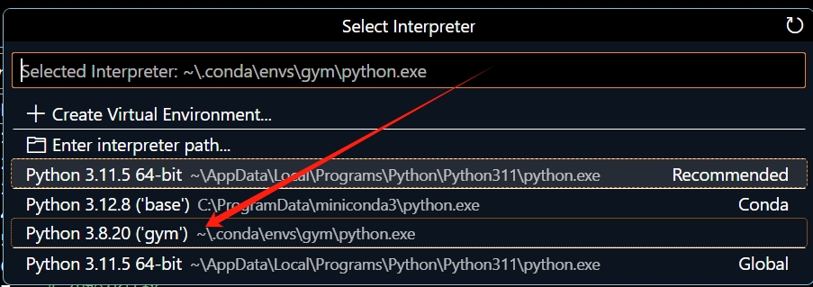
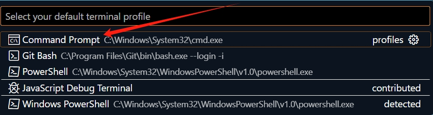

# 四足DRL毕设日志

- [四足DRL毕设日志](#四足drl毕设日志)
  - [项目日志](#项目日志)
    - [\[2025 年 2 月 15 日 星期六\]](#2025-年-2-月-15-日-星期六)
  - [极简环境配置](#极简环境配置)
    - [Miniconda 安装](#miniconda-安装)
      - [Windows 系统](#windows-系统)
      - [Linux 系统](#linux-系统)
    - [Pytorch 和 Gymnasium 安装](#pytorch-和-gymnasium-安装)
    - [VScode 代码开发环境配置](#vscode-代码开发环境配置)
      - [Windows 系统](#windows-系统-1)
      - [Linux 系统](#linux-系统-1)
    - [VScode 配置中文环境](#vscode-配置中文环境)
    - [GitHub Desktop Linux 安装教程](#github-desktop-linux-安装教程)
    - [VScode Markdown 语法编辑预览插件安装及使用教程](#vscode-markdown-语法编辑预览插件安装及使用教程)
  - [实战项目](#实战项目)
    - [1. 基于DDPG算法的倒立摆控制](#1-基于ddpg算法的倒立摆控制)


## 项目日志

### [2025 年 2 月 15 日 星期六]

今日在克隆四足 RL 毕设项目代码时，发现 GitHub 上 3.7MB 的压缩包，用如下命令克隆：
```bash
git clone https://github.com/cdh66666/Deep_RL_Control.git
```
克隆后项目达 900MB，原因是该命令默认克隆所有历史提交记录。解决办法是使用如下命令：
```bash
git clone --depth 1 https://github.com/cdh66666/Deep_RL_Control.git
```
此命令仅获取最新版本，可减少磁盘占用和克隆时间。后续将搭建项目环境并测试代码。 

## 极简环境配置
### Miniconda 安装
#### Windows 系统
1. 可从 Miniconda 官网自行下载：[Miniconda 下载](https://docs.anaconda.com/miniconda/install/#quick-command-line-install)
2. 或者通过 win + R 输入 cmd 回车打开命令行，运行以下代码（可一次性粘贴）：
```bash
curl https://repo.anaconda.com/miniconda/Miniconda3-latest-Windows-x86_64.exe -o miniconda.exe
start /wait "" .\miniconda.exe /S
del miniconda.exe
```
3. 按 win 键，搜索 Anaconda Prompt 并打开，输入以下命令，创建一个以“gym”为名字的新的虚拟环境：
```bash
conda create --name gym python=3.8
```
4. 激活虚拟环境“gym”：
```bash
conda activate gym
```

#### Linux 系统
1. 打开终端，使用 `wget` 下载 Miniconda 安装脚本：
```bash
wget https://repo.anaconda.com/miniconda/Miniconda3-latest-Linux-x86_64.sh
```
2. 赋予脚本执行权限并运行安装脚本：
```bash
chmod +x Miniconda3-latest-Linux-x86_64.sh
./Miniconda3-latest-Linux-x86_64.sh
```
3. 按照安装提示完成安装，安装完成后，在终端输入以下命令，创建“gym”虚拟环境：
```bash
conda create --name gym python=3.8
```
4. 激活虚拟环境“gym”：
```bash
conda activate gym
```

### Pytorch 和 Gymnasium 安装
1. 访问 Pytorch 官网：[Pytorch 官网](https://pytorch.org/)
2. 向下滑动页面，选择配置，运行对应命令。
    - 本电脑配置：Stable (2.5.1) ---- Windows ---- Pip ---- Python ---- CPU，可在 Anaconda Prompt 运行如下命令：
```bash
conda activate gym
pip3 install torch torchvision torchaudio
```
3. 安装 Gymnasium 及相关库：
```bash
pip install gymnasium
pip install matplotlib
```

### VScode 代码开发环境配置
#### Windows 系统
1. 从 VScode 官网下载安装包并安装：[VScode 官网](https://code.visualstudio.com/)
2. 打开 VScode，按 Ctrl + shift + p 打开命令提示行。
3. 安装 Python 解释器插件。
4. 命令行输入 `Python: select interpreter`，选择要使用的 Python 解释器（选虚拟环境 gym 对应解释器）。
    
5. 在命令行输入 `Terminal: select default profile`，确保你选择的是合适的终端配置（如 `Command Prompt` 等），而非 `powershell`。
    
6. 出现相应界面即可在 VScode 终端中进行环境配置操作（gym&cmd）。
7. 安装优化代码插件，在搜索栏搜索安装：
    - 安装 MarsCode AI 插件，代码自动联想补全，超级实用。
    - 安装 Jupyter 插件，优化 debug 体验。

#### Linux 系统
1. **通用安装方法（适用于大多数基于 Debian 或 Ubuntu 的系统）**：
    - 打开终端，更新系统软件包列表并安装必要工具：
```bash
sudo apt-get update
sudo apt-get install wget gpg
```
    - 下载并安装 Microsoft GPG 密钥：
```bash
wget -qO- https://packages.microsoft.com/keys/microsoft.asc | gpg --dearmor > packages.microsoft.gpg
sudo install -D -o root -g root -m 644 packages.microsoft.gpg /etc/apt/keyrings/packages.microsoft.gpg
```
    - 添加 VScode 软件源：
```bash
sudo sh -c 'echo "deb [arch=amd64,arm64,armhf signed-by=/etc/apt/keyrings/packages.microsoft.gpg] https://packages.microsoft.com/repos/code stable main" > /etc/apt/sources.list.d/vscode.list'
rm -f packages.microsoft.gpg
```
    - 更新软件包列表并安装 VScode：
```bash
sudo apt-get update
sudo apt-get install code
```
2. 后续步骤与 Windows 系统一致，按 Ctrl + shift + p 打开命令提示行，安装 Python 解释器插件，选择 Python 解释器、终端默认配置（如 `bash`），安装相关插件等。

### VScode 配置中文环境
1. 打开 VScode，按 Ctrl + shift + x 打开扩展面板。
2. 在搜索框输入 `Chinese (Simplified) Language Pack for Visual Studio Code` 并安装。
3. 安装完成后，右下角会提示重启 VScode，重启后界面即为中文。 

### GitHub Desktop Linux 安装教程
1. 打开终端，使用 `wget` 下载 GitHub Desktop 的 `.deb` 安装包（以 3.1.7 版本为例，你可根据实际情况调整版本号）：
```bash
wget https://github.com/shiftkey/desktop/releases/download/release-3.1.7-linux1/GitHubDesktop-linux-3.1.7-linux1.deb
```
2. 安装下载的 `.deb` 包（需确保系统已安装 `dpkg`）：
```bash
sudo dpkg -i GitHubDesktop-linux-3.1.7-linux1.deb
```
3. 如果安装过程中提示依赖缺失，可使用以下命令修复依赖：
```bash
sudo apt-get install -f
```
4. 安装完成后，你可以在应用程序菜单中找到 GitHub Desktop 并启动它。首次启动时，按照提示进行登录和相关设置即可使用。

### VScode Markdown 语法编辑预览插件安装及使用教程
1. **安装插件**：
    - 打开 VScode，按 Ctrl + shift + x 打开扩展面板。
    - 在搜索框输入 `Markdown All in One` 并安装。该插件提供了丰富的 Markdown 语法支持，包括代码块语法高亮、表格编辑等功能。
    - 另外，强烈推荐安装 `Markdown Preview Enhanced` 插件。它能提供更美观、功能更强大的 Markdown 实时预览功能，支持数学公式渲染、图表绘制等高级特性。在扩展面板搜索框输入该插件名称并安装。
2. **使用教程**：
    - **基本语法编辑**：安装 `Markdown All in One` 后，在新建或打开 Markdown 文件（`.md` 后缀）时，即可直接使用 Markdown 语法进行编辑。例如，输入 `# 标题` 生成一级标题，`## 二级标题` 生成二级标题等。使用 `* 列表项` 生成无序列表，`1. 列表项` 生成有序列表。
    - **实时预览**：安装 `Markdown Preview Enhanced` 后，打开 Markdown 文件，按 `Ctrl + Shift + V` 组合键（或者点击编辑器右上角的眼睛图标），即可在右侧打开实时预览窗口，实时展示 Markdown 内容渲染后的效果。在编辑区修改内容时，预览区会实时更新。
    - **高级功能**：`Markdown Preview Enhanced` 支持多种高级功能。例如，要插入数学公式，可使用 `$` 符号包裹 LaTeX 公式语法，如 `$E = mc^2$` 会渲染为 $E = mc^2$。绘制图表方面，可使用特定的语法，如 Mermaid 语法来创建流程图、时序图等。比如创建一个简单的流程图：

只需在 Markdown 文件中输入上述代码块，预览时就会显示为对应的流程图。
 
## 实战项目

### 1. 基于DDPG算法的倒立摆控制

